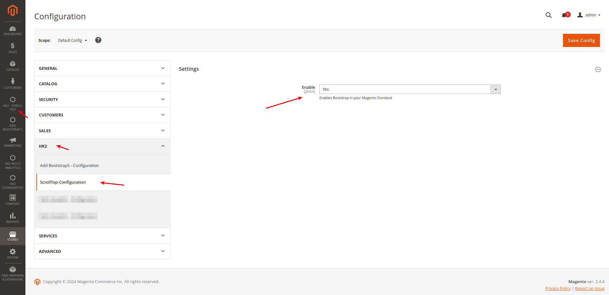

# HK2 Scroll Top

HK2 Scroll Top adds an intuitive icon at the bottom-right corner of each page so that with one click you will be at the top of the page. No more dragging of the scroll bar. It will be just fun and ergonomic to use. Scroll Top is an uncomplicated free Open Source Magento Module allowing site visitors to immediately and seamlessly get back to the top of your web page after scrolling a lengthy page.

**Please Note**:- This Module Adds Scroll to Top Button in Magento Store Frontend. Scroll to Top Button Automatically gets activated when you scroll down.

## 💰 Account & Pricing

This is a Open Source - Free to use Module. No charge or any fee is there to use it.

## 🧐 Features

1. No more dragging scroll bar.
2. Available on all pages of Magento Frontend Store.
3. Open Source - Free.
4. It loads ScrollTop CSS & Js, Only If Enabled from Admin Backend.

## 🚀 Supported Version

- Magento v2.3.5, 2.4.x

## How to install

### Method 1: Install ready-to-paste package

[Download Link - HK2 - ScrollTop - (https://github.com/basantmandal/HK2-ScrollTop/archive/refs/tags/1.2.0.zip)](https://github.com/basantmandal/HK2-ScrollTop/archive/refs/tags/1.2.0.zip)

Download the zip package and unzip it in app/code folder.

## Enable Extension:

```bash
php bin/magento module:enable HK2_ScrollTop
```

```bash
php bin/magento setup:upgrade
```

```bash
php bin/magento setup:static-content:deploy
```

```bash
php bin/magento cache:clean
```

## Disable Extension:

```bash
php bin/magento module:disable HK2_ScrollTop
```

```bash
php bin/magentosetup:upgrade
```

```bash
php bin/magento setup:static-content:deploy
```

```bash
php bin/magento cache:clean
```

### Method 2: Install via composer (Recommend)

Run the following command in Magento 2 root folder

```bash
composer require hk2/scrolltop
```

````bash
php bin/magento setup:upgrade

```bash
php bin/magento setup:static-content:deploy
````

## 🛠️ Maintenance mode

You may want to enable the maintenance mode when installing or updating the module, especially when working on a production website. To do so, run the two commands below before and after running the other setup commands:

### Enable Maintenance Mode

```bash
php bin/magento maintenance:enable
```

### Disable Maintenance Mode

```bash
php bin/magento maintenance:disable
```

Feel Free to send your suggestions of any changes/improvements, will be happy to add the changes.

### Usage - How Does The Extension Work?

Once module is enabled you can see it on all pages. Please check the Screenshots




## 🤫 Privacy

This extension does not read, change, store, or transmit any of your personal data (e.g., logins, passwords, messages, contacts) from any of the sites or your computer in absolutely any form.

## 📫 Support

For support or any bug report or changes mail me at - <support@hashtagkitto.co.in>

## 🐞 Bug Report

Please open an [issue](https://github.com/basantmandal/HK2-ScrollTop/issues) on GitHub.

When filing a bug remember that the better written the bug is, the more likely it is to be fixed.

You can also reach us at <support@hashtagkitto.co.in>

## 🍰 Contribution Guidelines 💖

Contributions are welcome! If you’d like to contribute to this project:

- Fork the repository.
- Create a new branch (git checkout -b feature/your-feature-name).
- Make your changes and commit them (git commit -am 'Add new feature').
- Push to the branch (git push origin feature/your-feature-name).
- Open a pull request.

**Please Note** :- I may be a bit delayed in responding or slow in responding due to low amount of free time. I apologize for the inconvenience and I appreciate your patience

## 🤝 Consent

By using any Product/Module/Application from Basant Mandal A.K.A (HK2 - Hash Tag Kitto), you hereby consent to our disclaimer and agree to its terms.

## 📢 Disclaimer

> **Basant Mandal (HK2 - Hash Tag Kitto)** does not make any warranties about the completeness, reliability and accuracy of this image or its related products. Any action you take upon the information you find here is strictly at your own risk.

> **Basant Mandal (HK2 - Hash Tag Kitto)** will not be liable for any losses and/or damages in connection with the use of our website.

## 💖Like my work? Help Us

Please rate my project or give some stars at [https://github.com/basantmandal/HK2-ScrollTop/issues](https://github.com/basantmandal/HK2-ScrollTop/issues). You can also contribute to make my Open Source Contribution more frequent and help others - [https://www.buymeacoffee.com/basantmandal](https://www.buymeacoffee.com/basantmandal) or [https://www.basantmandal.in/buymecoffee](https://www.basantmandal.in/buymecoffee)

## 📫 Feedback

If you have any feedback, please reach out to us at <support@hashtagkitto.co.in>

## 🔗 Links:

Feel free to reach me through the below handles if you'd like to contact me.

[](https://www.basantmandal.in/)
[](https://www.linkedin.com/in/basantmandal/)

## 📜 License:

[](https://choosealicense.com/licenses/mit/)
[](https://opensource.org/licenses/)
[](http://www.gnu.org/licenses/agpl-3.0)
